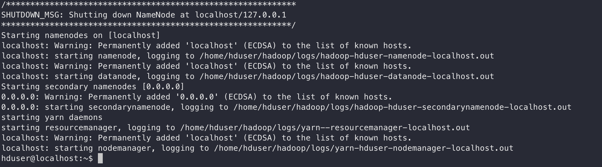
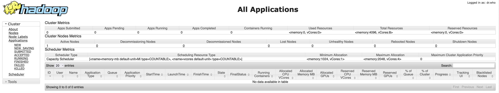
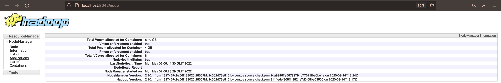
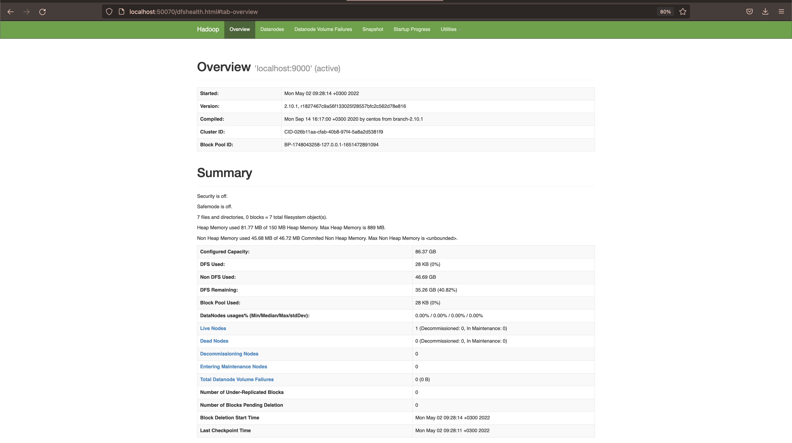
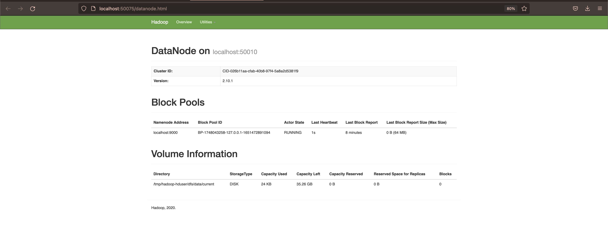
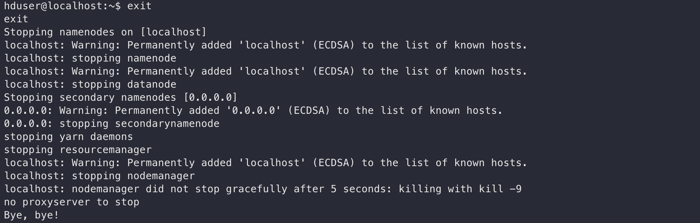

## Урок 1

1. Разверните у себя hadoop кластер внутри docker контейнера 
2. Проверьте работоспособность кластера, посмотрев на статус ресурс менеджера, нейм ноды и дата ноды
3. Остановите кластер
4. Вы пришли в компанию, в которой планируют строить Data Lake и DWH с нуля. Текущих данных около 15 Тб. Ежегодный прирост данных составляет ~500 Гб. Какую технологию вы бы предложили использовать и почему?

### Задание 1

Поднимаем контейнер с кластером в интерактивном режиме 

`docker run -it --name gbhdp \
-p 50090:50090 \
-p 50075:50075 \
-p 50070:50070 \
-p 8042:8042 \
-p 8088:8088 \
-p 8888:8888 \
-p 4040:4040 \
-p 4044:4044 \
--hostname localhost \
img-hdp-hadoop`

### Задание 2

#### Ресурс менеджер

#### Нод менеджер 

#### Нейм нода

#### Дата нода 

### Задание 3

Выключаем кластер командой `exit`

### Задание 4

В целом это зависит от самих данных. Если они реалиционные, то при таком приросте и изначальном объеме данных можно обойтись RDBMS. Если же данные малостроктурированы, то можно задуматься об использовании hadoop, хотя опять же при таком небольшом объеме и приросте данных это не очень целесообразно 
