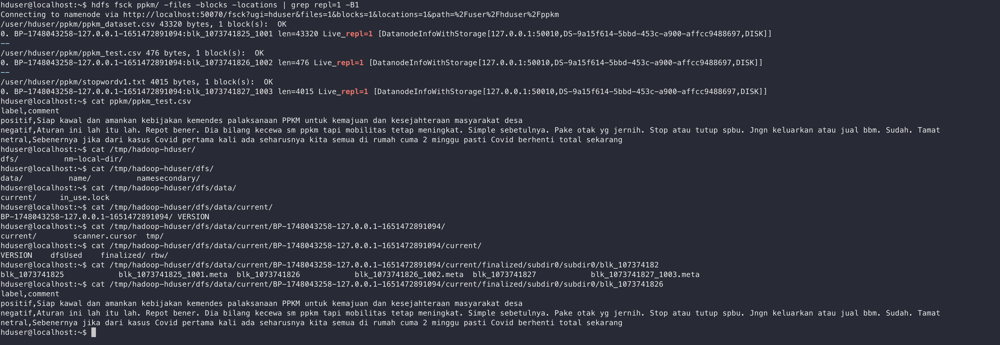

## Урок 2

1. Поместите датасет ppkm_sentiment у себя в HDFS и дайте всем пользователям на них полные права
2. Определите расположение блоков
3. У вас 20 файлов, каждый размером 130 мб. Сколько блоков будет аллоцировано в NameNode, при условии, что размер блока по умолчанию у вас 128 мб, а фактор репликации равен 3?
4. У вас 1 файл, размером 1.56 Тб. Сколько блоков будет аллоцировано в NameNode, при условии, что размер блока по умолчанию у вас 128 мб, а фактор репликации равен 3?
5. В вашей компании развернут Hadoop кластер из 400 нод. Фактор репликации равен 3. Сколько единовременно может быть выведено машин из строя, чтобы не было потери данных?

### Задание 1

Переносим данные в hdfs в директории ppkm

Изменяем права для всех файлов в директории ppkm

### Задание 2

С помощью команды fsck и флагов -files -blocks -locations выводим имена блоков для каждого файла. Далее вывол содержимое файла ppkm_test.csv в локакльной файловой системе.
 

### Задание 3 и 4

Если честно не очень понятно, что значит "сколько блоков будет алоцировано"? Это означает сколько записей будет в Name Node или о скольких блоках будет храниться информация в каждой записи.

Name Node хранит мапинг о соотвесвии между файлами и блоками. На нейм ноде каждому файлу соотвесвует одна запись. Поэтому для 20 файлов размером 130мб будет 20 записей и для одного файла размером 1.56Тб будет 1 запись. 

В каждой записи хранится данные о всех блоках. То есть в случае если у нас файл весит 130мб, а размер блока 128, то на каждый файл будет выделено по 2 блока, а с учетом репликации 6. то есть для 20 файлов 120. Файл размером 1.56Тб займет 12780 блоков, с репликацией 38340.

### Задание 5

Тоже не очень понятный вопрос. Это же зависит от заполненности нод и если среди этих 400 нод, Нейм нода, а нет Secondary, то достаточно вывести из строя одну)

Если считать что ноды заполнены полностью, то чтобы не было потери данных можно допустить выход из тсроя не больше 2/3 нод. 

