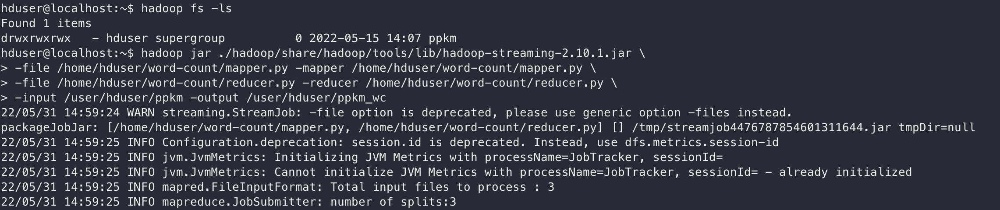

## Урок 3

 1. Может ли стадия Reduce начаться до завершения стадии Map? Почему?
 2. Приведите пример Map only и Reduce задачи.
 3. Разверните кластер hadoop, соберите WordCount приложение, запустите на датасете ppkm_sentiment и выведите 10 самых редких слов*
 4. Измените маппер в WordCount так, чтобы он удалял знаки препинания и приводил все слова к единому регистру
 5. *У вас есть два датасета с одинаковыми ключами. Вам нужно их объединить, суммировав значения с одинаковыми ключами. Как это сделать в MapReduce?
 6. *На кластере лежит датасет, в котором ключами является id сотрудника и дата, а значением размер выплаты. Руководитель поставил задачу рассчитать среднюю сумму выплат по каждому сотруднику за последний месяц. В маппере вы отфильтровали старые записи и отдали ключ-значение вида: id-money. А в редьюсере суммировали все входящие числа и поделили результат на их количество. Но вам в голову пришла идея оптимизировать расчет, поставив этот же редьюсер и в качестве комбинатора, тем самым уменьшив шафл данных. Можете ли вы так сделать? Если да, то где можно было допустить ошибку? Если нет, то что должно быть на выходе комбинатора?

### Задание 1

Не может так как стадии сортировки и шафла должны производиться над всеми данными. Иначе редьюсеры могут отработать неправильно. 

### Задание 2

 1. Предположим в hdfs у нас хронятся логи воркеров каких-то приложений. В каждой строке лога указано имя воркера из которого она. Можно написать мапер, который будет выводить только логи какого-то конкретного воркера. 

 2. А в качестве Reduce задачи мы можем считать сколько логов произведено каждым воркером(мапер будет уже не из пункта 1, а такой, что выводит: worker-name 1, в stdout) 

 ### Задание 3 

 Запускаем WC
 

 Выводим топ-10 результатов из файла с расчетами
 

 ### Задание 4

 Так если просто заменять знаки препинания на пробелы возникает много багов: считаются некоторые пробелы, ссылки рассыпаются и тд. Решил использовать регулярки(но я так понимаю лучше обходится без них так как это тяжелые операции). Использовал две регулярки: чтобы найти все url'ы и выкинуть их и для поиска слов.

 

 Топ-40 результат(чтобы попал url)

 

### Задание 5

Мапер и редьюсер похожи на WC. Мапер выводит ключ-значение, редьюсер сумирует по этим значениям. Если при запуске джобы мы укажим параметр `-D mapred.reducer.tasks=1`, то на выходе получим один файл который по сути будет объединением этих таблиц.

### Задание 6

Так нельзя делать так как, среднее от суммы средних не будет равняться просто среднему. (1+2+3+4)/4 != ((1+2+3)/3 + 4/1)/2. Но можно написать комбайнер который будет писать в вывоод сумму и количество выплат. 