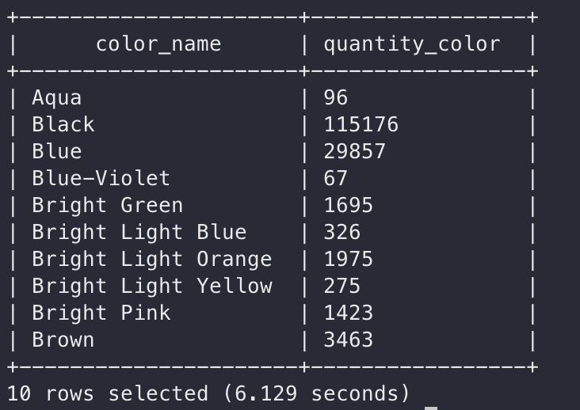

## Урок 4

Приложите составленные запросы и первые 10 строк результатов:
1. Установите Apache Hive в ваш контейнер с Apache Hadoop
2. Скачайте датасет lego-database и импортируйте его в Hive
3. Составьте запрос, который выведет имя набора (sets.name) с самым большим количеством деталей (sets.num_parts)
4. Составьте запрос, который выведет в каком году (sets.year) вышло больше всего наборов
5. Составьте запрос, который выведет общее количество деталей (inventory_parts.quantity) для каждого из цветов (colors.name)
6. Измените Dockerfile так, чтобы вместе с Hadoop устанавливался и запускался Hive

### Задание 1 и 6

Совместил эти пункты, только не получилось настроить запуск самого Hive Server. Удобнее будт посомтреть MR, но если коротко(все изменения в Dockerfile): 
 - Добавил команды из лекции по скачиванию бинарников и добавлению env
 - Инициализация Derby
 - Hive-site.xml хранится в папке с образом и переносится по аналогии с yarn-site.xml и тд.

### Задание 2

Загрузил в hive не весь датасет, а только таблицы, которые необходимы для задания(sets, colors, invetory_parts).

Запросы для создания таблиц и загрузки в них данных из локальной фс:

#### lego_sets

`CREATE TABLE lego_sets(set_num STRING, name STRING, year INT, theme_id INT,
num_parts INT)
COMMENT 'Information on lego sets'
ROW FORMAT DELIMITED
FIELDS TERMINATED BY ','
STORED AS TEXTFILE
TBLPROPERTIES('skip.header.line.count'='1');`

`LOAD DATA LOCAL INPATH '/home/hduser/lego/sets.csv' INTO TABLE lego_sets;`

#### lego_colors

`CREATE TABLE lego_colors(id INT, name STRING, rgb STRING, is_trans STRING)
COMMENT "Colours of lego sets in rgb "
ROW FORMAT DELIMITED
FIELDS TERMINATED BY ","
STORED AS TEXTFILE
TBLPROPERTIES('skip.header.line.count'='1');`

` LOAD DATA LOCAL INPATH '/home/hduser/lego/colors.csv' INTO TABLE lego_colors;`

#### lego_inventory_parts

`CREATE TABLE lego_inventory_parts(inventory_id INT, part_num STRING, color_id INT, quantity INT,  is_spare STRING)
COMMENT "Parts in lego invetories"
ROW FORMAT DELIMITED
FIELDS TERMINATED BY ","
STORED AS TEXTFILE
TBLPROPERTIES('skip.header.line.count'='1');`

`LOAD DATA LOCAL INPATH '/home/hduser/lego/inventory_parts.csv' INTO TABLE lego_inventory_parts;`

### Задания 3-5

`select ls.name from lego_sets as ls where ls.num_parts in (select Max(num_parts) from lego_sets);`

или 

`select * from lego_sets order by num_parts desc limit 1;`

Первый запрос выполнился за 6 сек, второй за 1.4 сек

Ответ: Taj Mahal

`SELECT year, COUNT(year) as num_of_sets FROM lego_sets group by year ORDER BY num_of_sets DESC LIMIT 1;`

Ответ: 2014

`select co.name color_name, count(p.quantity) quantity_color  from lego_inventory_parts p join lego_colors co on (p.color_id = co.id) group by co.name limit 10`

