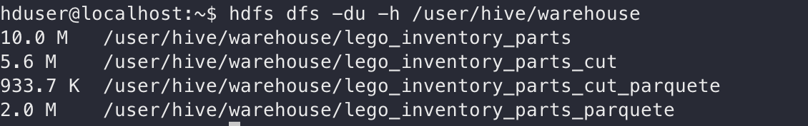

## Урок 5
   1. Создайте таблицу legoinventorypartscut без колонок типа STRING
   2. Сравните степень сжатия (отношения несжатого файла к сжатому) таблицы в которой есть колонки типа STRING с таблицей без колонок этого типа
   3. Напишите отличия и сходства форматов AVRO и CSV по-отношению друг к другу

### Задание 1-2

Создаю новую таблицу:

`create table lego_inventory_parts_cut as (select inventory_id, color_id, quantity from lego_inventory_parts)`

В качетсве протокола сжатия использую Snappy:

`set parquet.compression=SNAPPY;`

Создам и заполню две новые таблицы с форматом хранения в parquet

`create table lego_inventory_parts_parquete(inventory_id INT, part_num STRING, color_id INT, quantity INT, is_spare STRING) stored as PARQUET;`

`insert overwrite table lego_inventory_parts_parquete select * from lego_inventory_parts;`

`create table lego_inventory_parts_cut_parquete(inventory_id INT, color_id INT, quantity INT) stored as PARQUET;`

`insert overwrite table lego_inventory_parts_cut_parquete select * from lego_inventory_parts_cut;`

Размеры файлов: 

Таким образом степень сжатия 5 для таблицы со строчным типом и около 6 без него. Можно сделать вывод что основное сжатие достигается за счет колонок с типом INT, скорее всего это связанно с тем, что в них есть много повторяющихся значений. 

### Задание 3

AVRO и CSV оба относятся к строчным форматам данных. Сама структура AVRO похожа на csv(четкое отделение между блоками данных). Основные отличия в том, что в AVRO данные хранятся в двоичном формате, а также в avro есть четкая схема данных и поддерживается разделисмость, так как есть специальный символ разделения между данными.  
