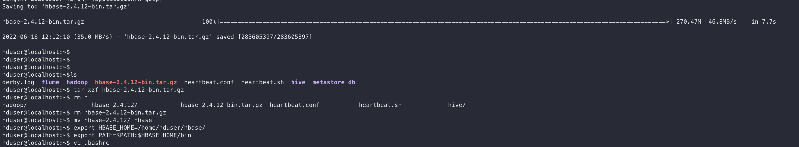
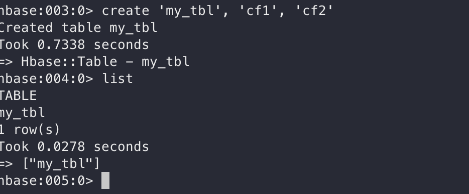
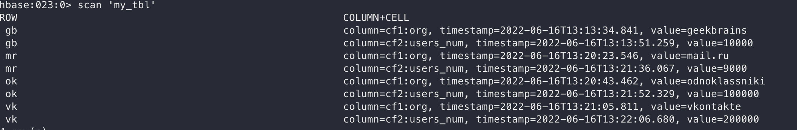
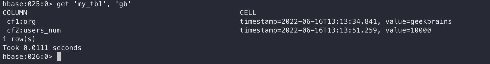
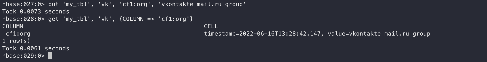
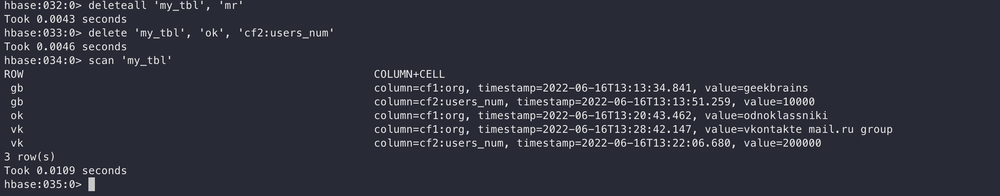

### Урок 7

1. Установите HBase
2. Создайте таблицу
3. Залейте 5 произвольных записей
4. Выполните одну операцию UPDATE
5. Выполните одну операцию DELETE
6. Выполните SCAN по всем записям

Установка HBase

Создание таблицы 

Записи в таблице через скан

Записи для конкретного ключа

Update

Delete
